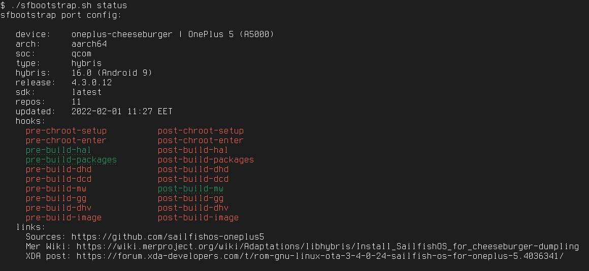

# sfbootstrap
The all-in-one Sailfish OS local development bootstrapping script.

## Screenshot


## Quick start
In case you haven't already, you should configure git with the basics:
```bash
git config --global user.name "Your Name"
git config --global user.email "youremail@example.com"
git config --global color.ui "auto"
```
Then get `sfbootstrap`:
```bash
git clone https://github.com/JamiKettunen/sfbootstrap.git
cd sfbootstrap
```
### Existing (Hybris) ports
```bash
# to choose your device interactively:
./sfbootstrap.sh init
# or if you know it's name already:
./sfbootstrap.sh init vendor-device
# if you're interested about the port details:
./sfbootstrap.sh status

./sfbootstrap.sh chroot setup
./sfbootstrap.sh sync
./sfbootstrap.sh build hal
./sfbootstrap.sh build packages
```
With that the created `images` directory should have the Sailfish OS artifacts for your chosen device :)
### New ports
Start with `./sfbootstrap.sh init` and look at the other functions and arguments available under `./sfbootstrap.sh` etc. while following the usual [HADK](https://sailfishos.org/develop/hadk/) and potential [FAQ](https://github.com/mer-hybris/hadk-faq) steps.

For documentation on env.sh variables and whatnot feel free to look at [the sfbootstrap wiki](https://github.com/JamiKettunen/sfbootstrap/wiki)!

## Environment variables
There are a few configurable (set outside the script in env) variables that can be used by [`sfbootstrap`](sfbootstrap.sh):
* `SUDO`: Superuser permission elevation program when not running as root, defaults to `sudo`
* `SFB_DEBUG`: Numeric boolean to enable debugging, defaults to `0`
* `SFB_COLORS`: Numeric boolean to enable colored output, defaults to `1`
* `SFB_JOBS`: Numeric amount of sync and build jobs, defaults to all available CPU threads
* `SFB_ROOT`: Path to runtime root directory, defaults to script execution directory
* `PLATFORM_SDK_ROOT`: Directory path  all chroots, defaults to `$SFB_ROOT/chroot`

## Scripting
If you're interested in scripting, any of the `sfb_`-prefixed functions can be executed via the [`sfbootstrap`](sfbootstrap.sh) script when passed as arguments; for example `./sfbootstrap.sh manual_hybris_patches_applied` can be used to check if [hybris-patches](https://github.com/mer-hybris/hybris-patches) are applied in the local tree.

## Files read from host environment
* `~/.gitconfig` (reused for `repo` in HA build chroot for automation etc.)

## See also
* [postmarketOS' pmbootstrap](https://gitlab.com/postmarketOS/pmbootstrap)
* [void-bootstrap (another project of mine)](https://github.com/JamiKettunen/void-bootstrap)
